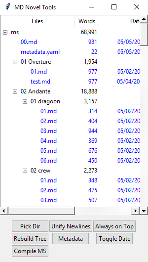

# MD Novel Tools

[Github Home](https://github.com/arcandio/MDNovelTools)

* **What is it?** It's a toolkit to mimic Literature & Latte's wonderful Scrivener, but for plaintext Markdown files.
* **Why you do this?** Writing, synchronizing, and editing long-form documents is easier when document versions can be compared. What better way to compare and keep track of your writing than using [Git](https://git-scm.com/), or another source control management system?
* **How does it work?** Right now, you need to have Python and Pandoc installed. Then you download the source and run the `tools.pyw` file and boom, you get an app:

## Features

### Tree View

* `Double-click` a file to open it in your default Markdown editor.
* Resizable columns.

### Toolbox

* `Pick Dir` selects a directory to use as the base level for your manuscript. *It will look for/put other, non-manuscript files in the parent of this directory.*
* `Rebuild Tree` refreshes the file tree. The app doesn't automatically do this for you. (It's hard to watch files, cross platform, in Python.)
* `Compile MS`
* `Spread Newlines`†: Inserts a space between lines with text.
* `Metadata` Creates or opens a metadata file next to your manuscript folder. Default provided with common items.
* `Always on Top` Makes the app float over other windows.
* `Toggle Date` hides or shows the Date column, which may or may not be useful to all writers.

† Operates on selected files

### Comments

* `> Comments look like this. <` They're Blockquotes that end with a `<` character.
  * Markdown doesn't have a dedicated commenting system out of the box, so we've opted to use BlockQuote because a a lot of fiction doesn't use this typographical convention. I'm looking for other solutions as well.
  * Comments are stripped from the text when you `Compile MS`

## Suggested Markdown Editors

* [Typora](https://typora.io/)
* [Sublime Text](https://www.sublimetext.com/3)
* [Atom.io](https://atom.io/)

